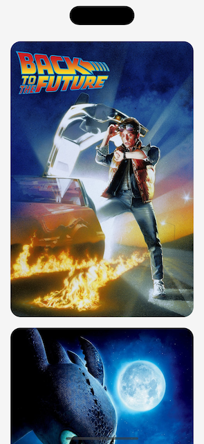

# CachedAsyncImage

[](https://github.com/apple/swift-package-manager)

Async image loading with progress and cache for SwiftUI.

## Screenshots



## Installation

### [Swift Package Manager](https://swift.org/package-manager/)

Going to Xcode `File` > `Add Packages...` and add the repository by giving the URL  
`https://github.com/bullinnyc/CachedAsyncImage`  
Enjoy!

## Usage

```swift
import CachedAsyncImage
```

### Quick start

**Note:** `placeholder` is an optional parameter.

```swift
let exampleUrl = "https://example.com/image.jpg"

CachedAsyncImage(
    url: exampleUrl,
    placeholder: { progress in
        // Create any view for placeholder (optional).
        ZStack {
            Color.yellow
            
            ProgressView() {
                VStack {
                    Text("Downloading...")
                    
                    Text("\(progress) %")
                }
            }
        }
    },
    image: {
        // Customize image.
        Image(uiImage: $0)
            .resizable()
            .scaledToFill()
    }
)
```

### Use it to the fullest

**Note:** `placeholder` and `error` is an optional parameters.

```swift
let exampleUrl = "https://example.com/image.jpg"

CachedAsyncImage(
    url: exampleUrl,
    placeholder: { progress in
        // Create any view for placeholder (optional).
        ZStack {
            Color.yellow
            
            ProgressView() {
                VStack {
                    Text("Downloading...")
                    
                    Text("\(progress) %")
                }
            }
        }
    },
    image: {
        // Customize image.
        Image(uiImage: $0)
            .resizable()
            .scaledToFill()
    },
    error: { error, retry in
        // Create any view for error (optional).
        ZStack {
            Color.yellow
            
            VStack {
                Group {
                    Text("Error:")
                        .bold()

                    Text(error)
                }
                .font(.footnote)
                .multilineTextAlignment(.center)
                .foregroundStyle(.red)
                
                Button(
                    action: retry,
                    label: {
                        Text("Retry")
                            .foregroundStyle(.black)
                            .opacity(0.8)
                    }
                )
                .padding(.top)
            }
            .padding()
        }
    }
)
```

### Set image cache limit if needed

**Note:** The default value is `0`, e.g. is no count limit and is no total cost limit.

```swift
init() {
    // Set image cache limit.
    ImageCache().wrappedValue.setCacheLimit(
        countLimit: 1000, // 1000 items
        totalCostLimit: 1024 * 1024 * 200 // 200 MB
    )
}
```

### Get cached image, remove cached image or image cache if needed.

```swift
struct MyView: View {
    @ImageCache private var imageCache

    var body: some View {
        // ...
    }

    // Get cached image.
    private func getCachedImage(for url: URL) -> UIImage? {
        imageCache[url]
    }

    // Remove cached image.
    private func removeCachedImage(for url: URL) {
        imageCache[url] = nil
    }

    // Remove image cache.
    private func removeImageCache() {
        imageCache.removeCache()
    }
}
```

## Requirements

- iOS 14.0 + / macOS 11.0 + / tvOS 14.0 + / watchOS 7.0 + / visionOS 1.0 +
- Xcode 15.0 +
- [SwiftUI](https://developer.apple.com/xcode/swiftui/)

## License

- CachedAsyncImage is distributed under the MIT License.
